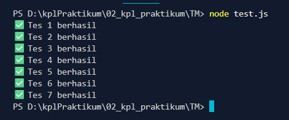

# TUUGAS MANDIRI: PEMOGRAMAN JAVA SCRIPT

Naufal Kafabih Khalwani

103122400036

SE-08-02

Dosen Pengampu: Yudah Islami Sulistiya

Asisten Praktikum: Adhiansyah Muhammad Pradana Frawown. Hammid Khaeruman

## SOAL

Kamu sudah menulis fungsi mulOfArray. Ujilah dengan input [2, 0, 26, 28, -2], dengan output yang seharusnya adalah 1456. Jika kamu menemukan bahwa hasilnya berbeda, bisakah kamu memperbaikinya? Jika kamu menemukan bahwa hasilnya sama, bisakah kamu menjelaskan mengapa demikian?

## KODE SUMBER

Tersedia di [tm.js](./tm.html) dan [test.js](./test.js)

## OUTPUT

## DESKRIPSI

function fizzBuzz(params) {
    if (!Array.isArray(params)) {
        return "Input tidak valid";
    }

    let result = params.map(num => {
        if (num % 14 === 0) {
            return "FizzBuzz";
        } else if (num % 7 === 0) {
            return "Buzz";
        } else if (num % 2 === 0) {
            return "Fizz";
        } else {
            return num;
        }
    });

    return result.join(" ");
}

Terdapat function fizzBuzz yang melempat params ke test, isi paramsnya yaitu sebuah perbandingan, lalu  jika params arraynya num % 14 = 0, maka akan menghasilkan FizzBuzz. Jika num % 7 = 0, maka akan menghasilkan Buzz dan jikalau num % 2 = 0, maka akan menghasilkan FIzz.