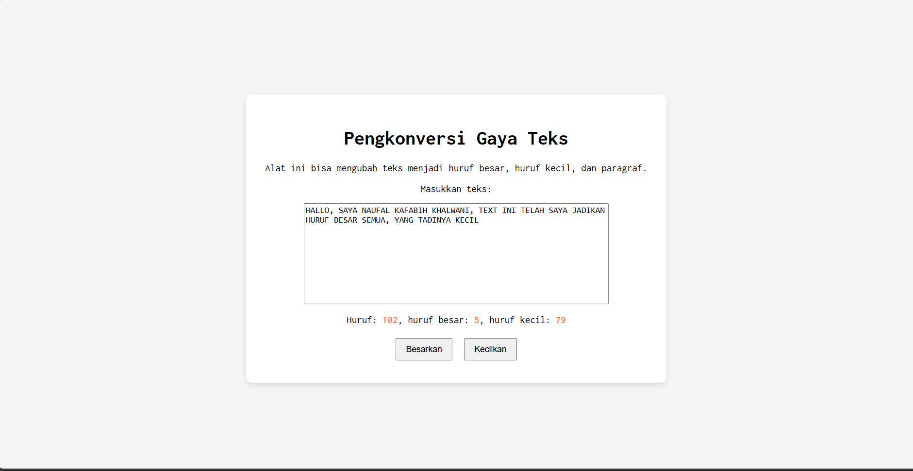

# TUUGAS MANDIRI: GUI DENGAN HTML WITH CSS

Naufal Kafabih Khalwani

103122400036

SE-08-02

Dosen Pengampu: Yudah Islami Sulistiya

Asisten Praktikum: Adhiansyah Muhammad Pradana Frawown. Hammid Khaeruman

## SOAL

Setelah kamu menyelesaikan tugas pendahuluan (bisa buka di atas), terapkanlah fungsi untuk (1) menghitung huruf kecil yang disediakan di #hk, (2) mengubah huruf kecil ke huruf besar ketika pengguna menekan tombol #huruf-besar, dan (3) mengubah huruf besar ke huruf kecil ketika pengguna menekan tombol #huruf-kecil.

Untuk nomor 2 dan 3, tampilkan hasilnya di dalam editor-kecil.

Kemudian, hapuslah fitur "Paragrafkan" dari alat.

## KODE SUMBER

Tersedia di [index.js](./index.html), [index.css](./index.css) dan [index.html](./index.html)

## OUTPUT

## DESKRIPSI

[index.html](./index.html)
    

        <button id="huruf-besar">Besarkan</button>
        <button id="huruf-kecil">Kecilkan</button>
    

Pada button tersebut saya telah mengubah, yang tadinya ada "paragrafkan", sekarang sudah saya hapus.

[index.js](./index.js) 

const upperButton = document.getElementById("huruf-besar");
variable upperButton untuk menampung button yang diambil berdasarkan ID nya

const lowerButton = document.getElementById("huruf-kecil");
variable loweButton untuk menampung buttong yang diambil berdasarkan ID nya

Lalu saya membuat 2 Function

upperButton.addEventListener("click", () => {
    const text = editorElement.value;
    editorElement.value = text.toUpperCase();
});

Ketika user click button dengan ID upperButton, maka value dari textnya akan diubah menjadi huruf besar semua

lowerButton.addEventListener("click", () => {
    const text = editorElement.value;
    editorElement.value = text.toLowerCase();
});

Ketika user click button dengan ID lowerButton, maka value dari textnya akan diubah menjadi huruf kecil semua

