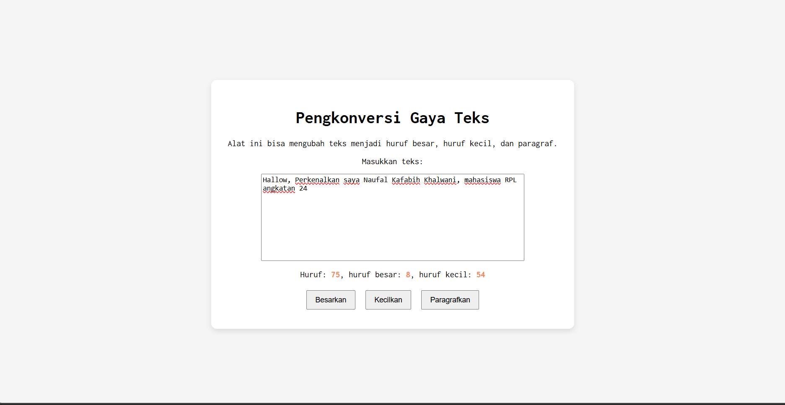

# TUUGAS PENDAHULUAN: GUI DENGAN HTML WITH CSS

Naufal Kafabih Khalwani

103122400036

SE-08-02

Dosen Pengampu: Yudah Islami Sulistiya

Asisten Praktikum: Adhiansyah Muhammad Pradana Frawown. Hammid Khaeruman

## SOAL

Buatlah tata letak laman yang kamu buat berada di tengah seperti di bawah ini, dan juga ubah font-nya dengan Inconsolata dari Google Fonts.

## KODE SUMBER

Tersedia di [index.js](./index.html), [index.css](./index.css) dan [index.html](./index.html)

## OUTPUT

## DESKRIPSI

const editorElement = document.getElementById("editor-kecil");

const charCountElement = document.getElementById("hf");

const uperCountElement = document.getElementById("hb");

const lowerCountElement = document.getElementById("hk");

editorElement.addEventListener("input", (event) => {

    const text = event.target.value; 
    const textLength = text.length;

    charCountElement.textContent = textLength;

    let upperCount = 0;
    let lowerCount = 0;

    for (let char of text){
        (char >= "A" && char <= "Z")
            ? upperCount++
            : (char >= "a" && char <= "z")
            ? lowerCount++
            : null;
    }

    uperCountElement.textContent = upperCount;
    lowerCountElement.textContent = lowerCount;

});

itu adalah logika untuk menjalankan button saya. Saya mengambil ID button yang ada di [index.html](./index.html), lalu saya simpan dalam variable seperti diatas. Selanjutnya saya membuat function jikalau form di isi, maka function tersebut akan mendeteksi berapa panjang hurufnya, berapa upperCount dan lowerCount nya.