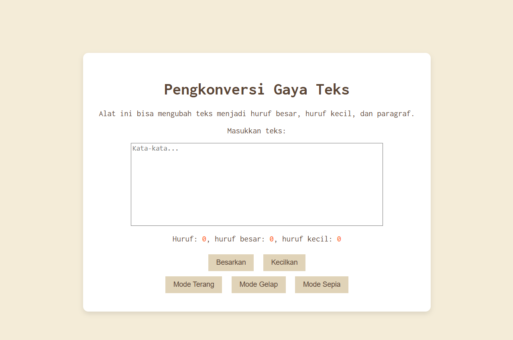

# TUUGAS MANDIRI: AUTOMATA DAN TABLE DRIVEN CONSTRUCTION

Naufal Kafabih Khalwani

103122400036

SE-08-02

Dosen Pengampu: Yudah Islami Sulistiya

Asisten Praktikum: Adhiansyah Muhammad Pradana Frawown. Hammid Khaeruman

## SOAL

Tambahkan mode sepia dengan ketentuan:

Elemen	Warna
Latar belakang	#F4ECD8
Warna teks	#5B4636
Biarkan form tetap warna putih.

## KODE SUMBER

Tersedia di [index.js](./index.html), [index.css](./index.css) dan [index.html](./index.html)

## OUTPUT

 

## DESKRIPSI

<button id="mode-sepia">Mode Sepia</button>

Pada code [index.html](./index.html), saya membuat button sepia lalu saya men-style nya di [index.css](./index.css) dengan code

body.sepia-mode {
    background-color: #F4ECD8;
    color: #5B4636;
}

/* container tetap putih */
.sepia-mode .container {
    background-color: white;
    color: #5B4636;
}

.sepia-mode .kotak-input {
    background-color: white;
    color: #5B4636;
}

.sepia-mode button {
    background-color: #e0d3b8;
    color: #5B4636;
}

kemudian agar bisa on click saya membuat funtion di [index.js](./index.js)

darkButton.addEventListener("click", () => {
    document.body.classList.add("dark-mode");
    document.body.classList.remove("sepia-mode");
});

