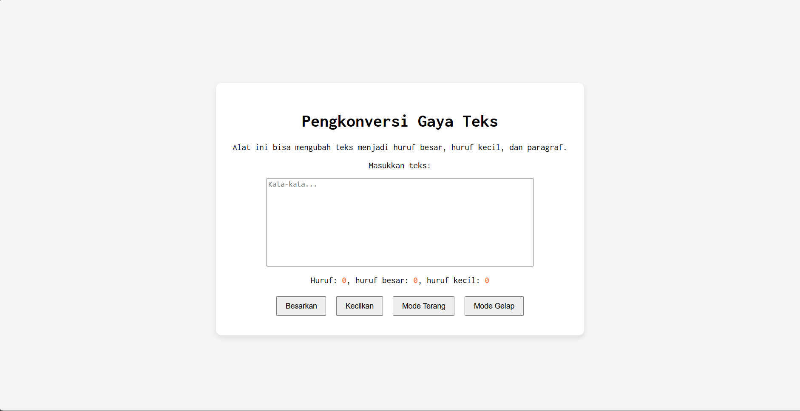
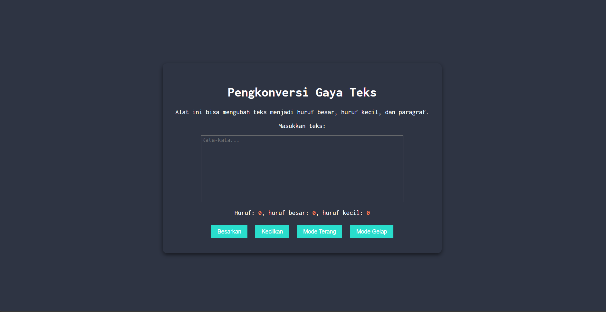

# TUUGAS PENDAHULUAN: AUTOMATA DAN TABLE DRIVEN CONSTRUCTION

Naufal Kafabih Khalwani

103122400036

SE-08-02

Dosen Pengampu: Yudah Islami Sulistiya

Asisten Praktikum: Adhiansyah Muhammad Pradana Frawown. Hammid Khaeruman

## SOAL

Tambahkan mode gelap sekaligus untuk editor-kecil dan tombol-tombolnya. Ketentuan warna untuk latar belakang editor-kecil adalah #2e3443, sementara untuk tombol adalah #29ddcc. Teks untuk tombol tetap mengikuti warna teks sebelumnya.

## KODE SUMBER

Tersedia di [index.js](./index.html), [index.css](./index.css) dan [index.html](./index.html)

## OUTPUT

 

## DESKRIPSI

darkButton.addEventListener("click", () => {
   
    document.body.classList.add("dark-mode");
});

lightButton.addEventListener("click", () => {
   
    document.body.classList.remove("dark-mode");
});

Pada code [index.js](./index.js), saya membuat 2 function untuk menjalankan button yang telah saya berinama darkButton dan lightButton. Ketika button on cick, maka laman akan berubah sesuai dengan apa  yang saya design di [index.css](./index.css) 

body.dark-mode{
   
    background-color: #2e3443;
    color: white;
}

.dark-mode .container{
   
    background-color: #2e3443;
    color: white;
    box-shadow: 0px 4px 10px rgba(0,0,0,0.5);;
}

.dark-mode .kotak-input {
   
    background-color: #2e3443;
    color: white;
}

.dark-mode button{
  
    background-color: #29ddcc;
    color: inherit;
    border: none;
}

Pada code [index.css](./index.css), saya memanggil beberapa class atau widget, ketka button dark on click, maka laman akan berubah menjadi dark mode.

