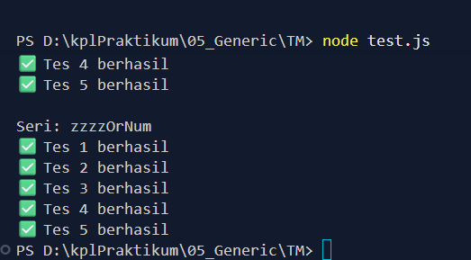

# TUGAS MANDIRI: FUNGSI GENERIC

Naufal Kafabih Khalwani
103122400036
SE-08-02

Dosen Pengampu: Yudah Islami Sulistiya

Asisten Praktikum: Adhiansyah Muhammad Pradana Frawown, Hammid Khaeruman

## SOAL

Buatlah dua buah fungsi yaitu `zzzzOrNum` dan `fizzBuzz` dengan ketentuan sebagai berikut:

* `zzzzOrNum` menerima satu bilangan bulat dan mengembalikan:

  * `"Fizz"` jika kelipatan 3
  * `"Buzz"` jika kelipatan 5
  * `"FizzBuzz"` jika kelipatan 3 dan 5
  * atau angka itu sendiri

* `fizzBuzz` menerima array berisi bilangan bulat dan mengembalikan array hasil transformasi menggunakan fungsi `zzzzOrNum`

* Kedua fungsi harus menggunakan **JSDoc** dan valid pada konfigurasi `checkJs` (TypeScript strict)

## KODE SUMBER

Tersedia di [fizz.js](./fizz.js)

## OUTPUT

## DESKRIPSI

Pada program ini, dibuat dua fungsi utama yaitu `zzzzOrNum` dan `fizzBuzz` yang digunakan untuk menerapkan aturan FizzBuzz dengan bantuan validasi tipe data melalui JSDoc.

Fungsi `zzzzOrNum` berfungsi untuk mengolah satu nilai bilangan. Di bagian awal, dilakukan pengecekan tipe data menggunakan `typeof` serta `Number.isInteger()` untuk memastikan bahwa input yang diberikan adalah bilangan bulat. Jika tidak memenuhi syarat, maka fungsi akan menghasilkan error dengan `TypeError`.

Setelah lolos validasi, dilakukan beberapa pengecekan kondisi:

* Jika bilangan merupakan kelipatan 3 dan 5, maka hasilnya adalah `"FizzBuzz"`
* Jika hanya kelipatan 3, maka hasilnya `"Fizz"`
* Jika hanya kelipatan 5, maka hasilnya `"Buzz"`
* Jika tidak termasuk ketiganya, maka nilai asli akan dikembalikan

Fungsi `fizzBuzz` digunakan untuk memproses data dalam bentuk array. Pertama, fungsi memastikan bahwa input yang diberikan merupakan array dengan menggunakan `Array.isArray()`. Jika bukan, maka akan terjadi error.

Kemudian dilakukan pengecekan pada setiap elemen array menggunakan `forEach` untuk memastikan seluruh isi array berupa bilangan bulat. Jika ditemukan data yang tidak sesuai, maka fungsi akan menghentikan proses dengan melempar error.

Setelah semua data dinyatakan valid, fungsi memanfaatkan `.map()` untuk mengubah setiap elemen array dengan memanggil fungsi `zzzzOrNum`. Hasilnya adalah array baru yang berisi kombinasi antara angka dan string sesuai aturan FizzBuzz.