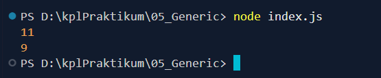

Berikut dokumentasi yang sudah aku rapikan sesuai format yang kamu mau 👇

---

# TUUGAS PENDAHULUAN: FUNGSI GENERIC PENGHITUNG KARAKTER

Naufal Kafabih Khalwani
103122400036
SE-08-02

Dosen Pengampu: Yudah Islami Sulistiya

Asisten Praktikum: Adhiansyah Muhammad Pradana Frawown, Hammid Khaeruman

---

## SOAL

Buatlah sebuah fungsi generic yang dapat menghitung jumlah seluruh karakter dan jumlah huruf (tanpa spasi) dalam sebuah string. Fungsi tersebut harus dapat digunakan dengan parameter mode yang berbeda.

---

## KODE SUMBER

Tersedia di [index.js](./index.js)

## OUTPUT

 

## DESKRIPSI

Pada kode di atas, saya membuat sebuah fungsi bernama `hitung` yang bersifat generic. Fungsi ini menerima dua parameter yaitu `str` sebagai input string dan `mode` sebagai penentu jenis perhitungan.

Di dalam fungsi, dilakukan perulangan menggunakan `for...of` untuk membaca setiap karakter dalam string.

* Jika `mode` bernilai `"semua"`, maka semua karakter termasuk spasi akan dihitung.
* Jika `mode` bernilai `"huruf"`, maka karakter spasi akan diabaikan sehingga hanya huruf saja yang dihitung.

Nilai hasil perhitungan disimpan dalam variabel `count` dan dikembalikan menggunakan `return`.

Pada bagian akhir kode, fungsi diuji menggunakan string `"Bar bar bar"`:

* Hasil `"semua"` adalah 11 karena termasuk spasi
* Hasil `"huruf"` adalah 9 karena spasi tidak dihitung

Pemanggilan terakhir tidak menggunakan `console.log`, sehingga tidak menampilkan output apa pun di console.
