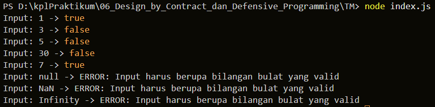

# TUGAS MANDIRI: Design by Contract dan Defensive Programming

Naufal Kafabih Khalwani  
103122400036  
SE-08-02  

Dosen Pengampu: Yudah Islami Sulistiya  

Asisten Praktikum: Adhiansyah Muhammad Pradana Frawown, Hammid Khaeruman  

---

## SOAL

Tugasmu adalah membuat fungsi yang menolak bilangan-bilangan kelipatan 3, 5, atau 15 (fizz buzz), menerima bilangan yang bukan termasuk "fizz buzz", serta melempar error jika input bukan bilangan bulat yang valid.

---

## KODE SUMBER

Tersedia di [index.js](./index.js)

---

## OUTPUT

---

## DESKRIPSI

Dalam tugas ini, digunakan pendekatan Defensive Programming untuk memastikan bahwa fungsi yang dibuat mampu menangani berbagai kemungkinan input yang tidak valid.

Fungsi `is_not_fizzbuzz(number)` dirancang untuk:
1. Menerima bilangan bulat yang valid
2. Menolak bilangan kelipatan 3, 5, atau 15 (fizz buzz)
3. Melempar error jika input tidak valid

Validasi dilakukan di awal fungsi dengan memastikan bahwa input:
- Bertipe number
- Bukan NaN
- Bukan Infinity
- Merupakan bilangan bulat

Jika kondisi tersebut tidak terpenuhi, maka fungsi akan melempar TypeError. Hal ini penting untuk mencegah error yang tidak terduga selama program berjalan.

Setelah validasi, fungsi akan melakukan pengecekan apakah bilangan merupakan kelipatan 3 atau 5. Jika iya, maka fungsi mengembalikan nilai false, yang berarti bilangan tersebut termasuk kategori "fizz buzz". Sebaliknya, jika bukan kelipatan 3 atau 5, maka fungsi mengembalikan true.

Pendekatan ini menunjukkan penerapan Defensive Programming, di mana program secara aktif melindungi dirinya dari input yang tidak valid. Dengan cara ini, kode menjadi lebih robust, aman, dan mudah dipelihara.