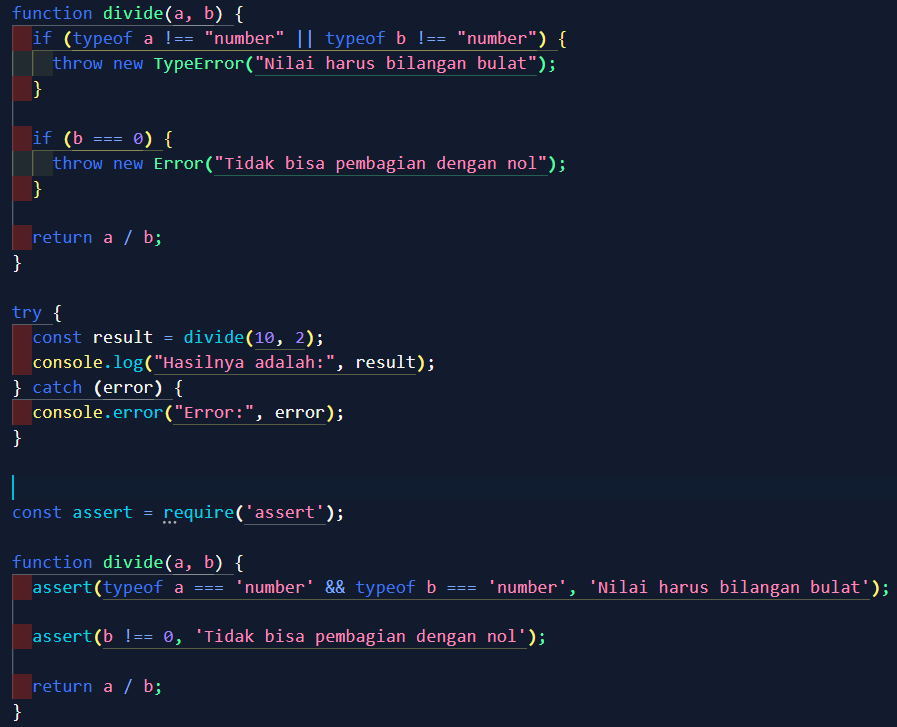

# TUGAS PENDAHULUAN: Design by Contract dan Defensive Programming

Naufal Kafabih Khalwani
103122400036
SE-08-02

Dosen Pengampu: Yudah Islami Sulistiya

Asisten Praktikum: Adhiansyah Muhammad Pradana Frawown, Hammid Khaeruman

## SOAL

Diberikan dua implementasi fungsi pembagian yang menggunakan pendekatan berbeda, yaitu asersi (assertion) dan eksepsi (exception). Jelaskan kapan sebaiknya menggunakan masing-masing pendekatan tersebut dan apakah harus memilih salah satu atau dapat menggunakan keduanya.

## KODE SUMBER

Tersedia di [index.js](./index.js)

## OUTPUT

## DESKRIPSI

Dalam pengembangan perangkat lunak, validasi terhadap input dan kondisi program merupakan hal yang sangat penting untuk menjaga kestabilan dan keandalan sistem. Pada kasus fungsi `divide(a, b)`, terdapat dua pendekatan yang dapat digunakan untuk menangani kesalahan, yaitu menggunakan asersi (assertion) dan eksepsi (exception). Meskipun keduanya memiliki tujuan yang sama, yaitu mencegah kesalahan, namun cara kerja dan konteks penggunaannya berbeda.

Asersi digunakan untuk memastikan bahwa suatu kondisi yang dianggap benar oleh programmer действительно terpenuhi saat program dijalankan. Dengan kata lain, asersi berfungsi sebagai alat bantu untuk mendeteksi kesalahan logika dalam kode selama tahap pengembangan. Pada fungsi pembagian, penggunaan asersi untuk mengecek apakah parameter bertipe number dan apakah pembagi tidak nol menunjukkan bahwa programmer menganggap kondisi tersebut tidak boleh dilanggar. Jika asersi gagal, maka program akan berhenti, yang menandakan adanya bug dalam kode. Namun, perlu diketahui bahwa asersi sering kali dinonaktifkan pada lingkungan production, sehingga tidak dapat diandalkan sebagai mekanisme utama penanganan error.

Berbeda dengan asersi, eksepsi digunakan untuk menangani kondisi error yang mungkin terjadi secara nyata saat program dijalankan, terutama ketika berhadapan dengan input dari pengguna atau sistem eksternal. Dalam fungsi `divide`, kesalahan seperti pembagian dengan nol atau input bukan angka adalah kondisi yang sangat mungkin terjadi. Oleh karena itu, penggunaan eksepsi dengan `throw` memungkinkan program untuk memberikan pesan kesalahan yang jelas dan memungkinkan error tersebut ditangani menggunakan blok `try...catch` tanpa menghentikan keseluruhan program secara tiba-tiba.

Dalam praktik terbaik, tidak disarankan untuk memilih salah satu secara mutlak antara asersi atau eksepsi. Keduanya memiliki peran yang saling melengkapi. Asersi sebaiknya digunakan untuk memastikan asumsi internal dan membantu proses debugging, sedangkan eksepsi digunakan untuk menangani error yang berasal dari luar dan dapat terjadi dalam kondisi nyata. Untuk fungsi seperti `divide`, penggunaan eksepsi lebih dianjurkan karena fungsi tersebut berpotensi menerima input yang tidak valid dari pengguna.

Dengan demikian, kombinasi antara asersi dan eksepsi merupakan pendekatan yang paling ideal. Asersi membantu menjaga kebenaran logika internal selama pengembangan, sementara eksepsi memastikan program tetap dapat berjalan dengan baik dan menangani kesalahan secara elegan saat digunakan oleh pengguna. Pendekatan ini akan menghasilkan kode yang lebih robust, aman, dan mudah untuk dipelihara.
