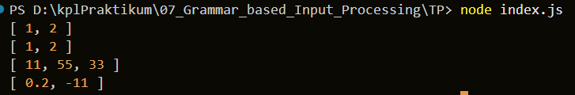

# TUGAS MANDIRI: Grammar based Input Processing

Naufal Kafabih Khalwani  
103122400036  
SE-08-02  

Dosen Pengampu: Yudah Islami Sulistiya  

Asisten Praktikum: Adhiansyah Muhammad Pradana Frawown, Hammid Khaeruman  

---

## SOAL

Buatlah fungsi yang mengubah deretan angka bertipe string menjadi larik angka.

Contoh:
- "1, 2" → [1, 2]
- ["1", "2"] → [1, 2]
- " 11,55,33   " → [11, 55, 33]
- ["0.2", "-11", "abc23"] → [0.2, -11]

---

## KODE SUMBER

Tersedia di [index.js](./index.js)

---

## OUTPUT

---

## DESKRIPSI

Pada tugas ini, dilakukan penguraian (parsing) data dari bentuk teks atau array menjadi struktur data berupa larik angka.

Fungsi `toNumberArray(input)` dirancang untuk menerima dua jenis input:
1. String berisi angka yang dipisahkan dengan koma
2. Array berisi string angka

Untuk input string, dilakukan beberapa tahap:
- Menggunakan metode `split(",")` untuk memisahkan data
- Menggunakan `trim()` untuk menghilangkan spasi berlebih
- Menggunakan `Number()` untuk mengubah string menjadi angka
- Menggunakan `filter()` untuk menghapus nilai yang tidak valid (NaN)

Untuk input array:
- Setiap elemen dikonversi menggunakan `Number()`
- Nilai yang tidak valid akan dihapus

Jika input bukan string atau array, maka fungsi akan melempar `TypeError` sebagai bentuk Defensive Programming.

Pendekatan ini menunjukkan penggunaan metode penguraian teks di JavaScript seperti `split`, `trim`, serta pemanfaatan fungsi konversi tipe data. Selain itu, penggunaan filter untuk menghapus data tidak valid membuat fungsi lebih robust dan aman digunakan.

Dengan demikian, fungsi ini mampu mengubah berbagai format input menjadi larik angka yang bersih dan siap digunakan.